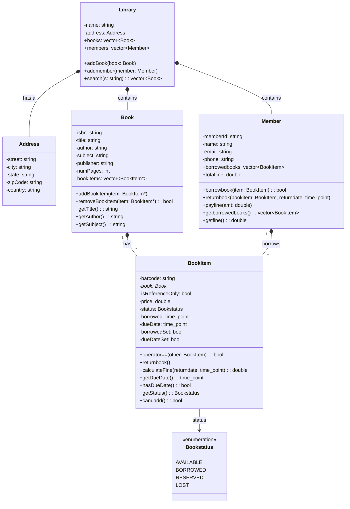
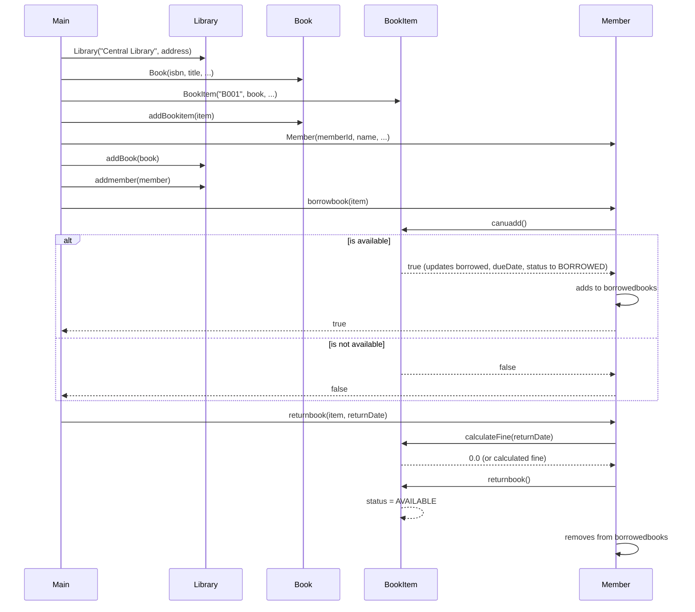

# Library Management System

Design a Library Management System that allows librarians to manage books and members, and enables members to borrow and return books.

The system should support the following operations:
1. Add, update, and remove books from the library catalog
2. Register new members and manage their information
3. Allow members to borrow and return books
4. Track due dates and calculate fines for overdue books
5. Search for books by various criteria (title, author, subject, etc.)
6. Manage different types of library items (books, magazines, DVDs, etc.)

## Requirements
- The system should maintain information about books including title, author, ISBN, publication date, and category
- Each book can have multiple physical copies, each with a unique ID
- Members should have profiles with contact information and borrowing history
- Members can borrow a limited number of books for a specific duration
- The system should track due dates and calculate fines for overdue books
- Librarians should be able to search for books and members
- The system should generate reports on book availability, overdue books, and popular books

## Constraints
- A book can be borrowed if at least one copy is available
- A member cannot borrow more than the allowed limit of books
- A book cannot be borrowed if the member has unpaid fines above a threshold
- Books marked as "reference" cannot be borrowed

## UML Class Diagram

## UML Sequence Diagram

The following sequence diagram shows the interactions when a member borrows and then returns a book, as demonstrated in `main.cpp`.

## Build Instructions

1. Ensure CMake and a C++ compiler are installed.
2. Run `cmake .` or `cmake -B build` to generate the build files.
3. Run `cmake --build build` or `make` to compile the project.
4. Execute the binary `LibrarySystem`.
