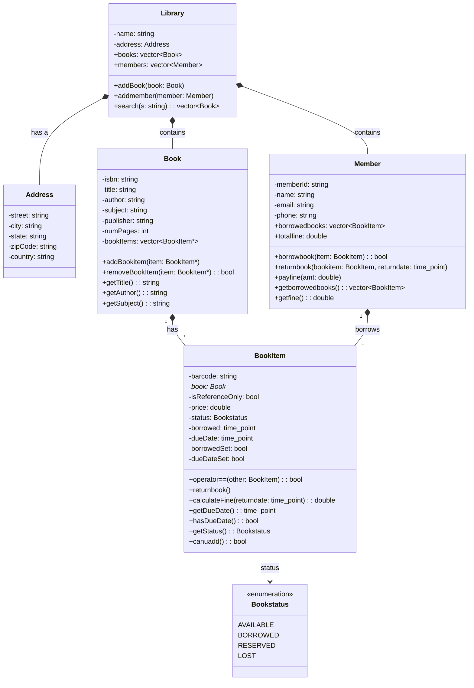
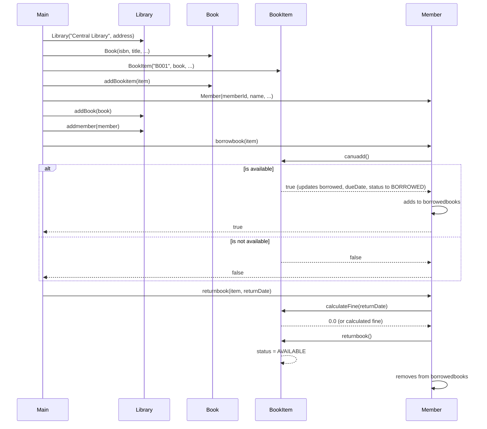

# Library Management System

This is a monolithic C++ codebase for a Library Management System refactored into a structured format. 

## UML Class Diagram

## UML Sequence Diagram

The following sequence diagram shows the interactions when a member borrows and then returns a book, as demonstrated in `main.cpp`.

## Build Instructions

1. Ensure CMake and a C++ compiler are installed.
2. Run `cmake .` or `cmake -B build` to generate the build files.
3. Run `cmake --build build` or `make` to compile the project.
4. Execute the binary `LibrarySystem`.
